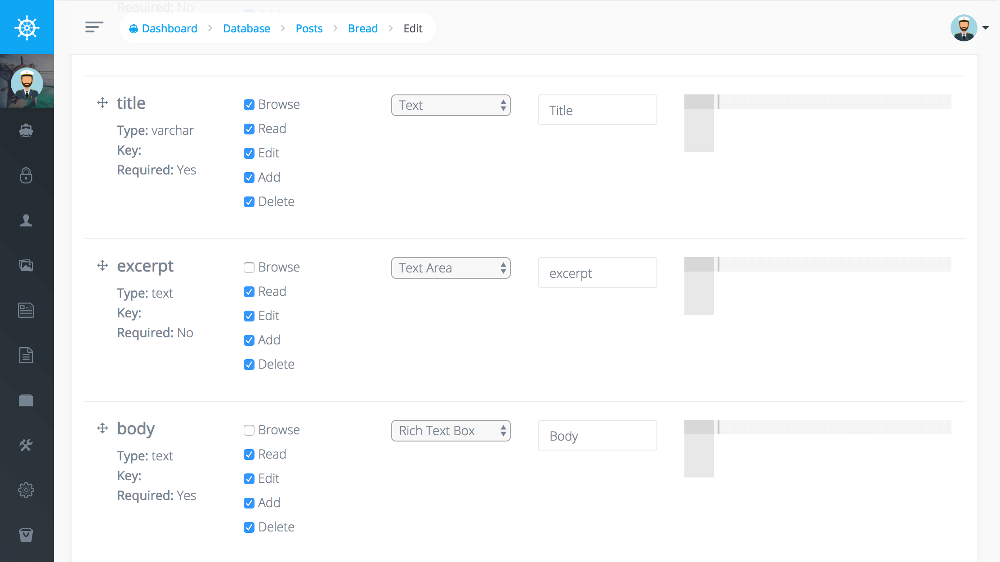
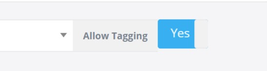
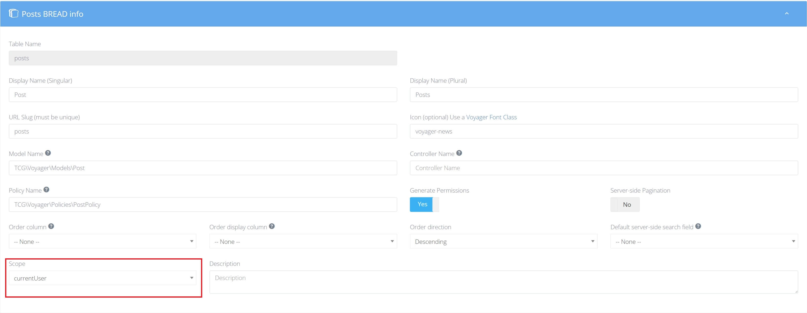

# 介绍

当你为一个数据库表新建或编辑BREAD的时候，如果您有权限的话，您可以通过BREAD设置“显示名称”，“URL slug”(可以理解为管理界面的路径)，“图片”，模型和控制器的命名空间，以及策略名称，
你也可以选择是否为其设置访问权限


向下滚动后，你可以看到这个表的所有字段的配置，您可以这里选择这些字段的显示位置

* BROWSE \(是否在列表页显示这个字段\)
* READ \(当你浏览这条信息的时候，决定是否显示这个字段\)
* EDIT \(是否显示在编辑页（允许编辑）\)
* ADD \(是否显示在创建页（允许创建）\)
* DELETE \(是否显示删除按钮（允许删除）\)



你也可以选择指定要为每个字段使用的表单类型。这可以是文本框、文本域、复选框、图像和许多其他类型的表单元素。

## 表单验证

在详细配置里，您可以使用一些简单的json来配置表单的验证规则，下面是一个必填并且数字不能大于12的验证规则

```php
{
    "validation": {
        "rule": "required|max:12"
    }
}
```

另外您可以像下面这样，自定义错误提示文字

```php
{
    "validation": {
        "rule": "required|max:12",
        "messages": {
            "required": "This :attribute field is a must.",
            "max": "This :attribute field maximum :max."
        }
    }
}
```

你可以使用下面的方式定义多个验证规则

```php
{
    "validation": {
        "rule": [
            "required",
            "max:12"
        ]
    }
}
```

### 操作的专属规则

默认情况下，上面设置的规则，在新建和编辑的时候，都会验证，如果想分开设置验证，可以使用下面的方式

```text
{
    "validation": {
        "rule": "min:3",
        "edit": {
            "rule": "nullable"
        },
        "add": {
            "rule": "required"
        }
    }
}
```

更多可用规则，可以查看 [Laravel 文档](https://learnku.com/docs/laravel/6.x/validation/5144).

## 使用标签

当你的表格其中一条记录需要关联其他表格的多条记录，使用这个选项，可以快捷的插入新的关联选项



然后你可以在一个空白的文本框中选择或者输入一个新的关联记录信息

::: warning 注意

这只会存储`display-column`这种字段，所以你必须确保关联表的其他字段必须为空或者有默认值
:::

## 排序

你可以使用拖拽的方式对你的数据进行排序，为了达到这个目的，你首先需要做如下设置:


- **Order column(列顺序)** 是一个用于保存排序值的字段，必须是数字类型
- **Order display column(排序显示列)** 在拖拽列表里显示的字段
- **Order direction(排序方向)** 确定一个排序的方向

然后来到你的数据列表页，你可以看到排序按钮 
按住其中一个按钮，然后拖拽到其他地方，你就可以更改排序了


## 设置查询范围

如果你想使用BREAD过滤你的列表页数据，你可以在你的模型里创建一个[查询作用域](https://learnku.com/docs/laravel/5.8/eloquent/3931),
比如说，你只想让你的用户看到他自己发布的文章，可以像这样定义一个查询作用域：

```php
<?php
public function scopeCurrentUser($query)
{
    return $query->where('author_id', Auth::user()->id);
}
```

接下来，来到BREAD的设置页，修改范围为 `currentUser`



然后点击提交按钮，你的用户就只能看到他自己发布的文章了
