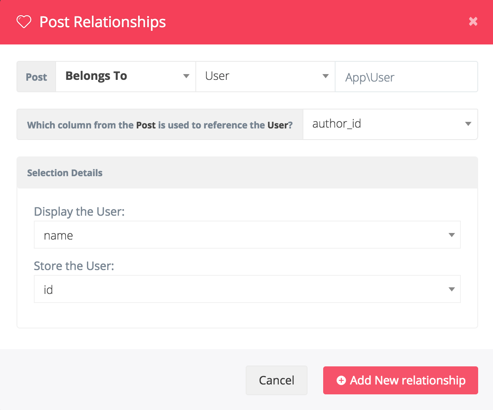

# 关联表

## 添加关联
使用BREAD你可以非常方便的在多个表之间创建关联关系， 在页面底部你可以看到一个按钮“创建关联”


::: warning 通知
如果你即将关联的表格，没有创建BREAD，那么你需要先去创建对应的BREAD，然后再回来添加关联，否则你将收到如下通知
:::


因此，只有你先创建好BREAD，才允许你创建一个新的关联，在按下“创建关联”按钮后，你会看到一个下面这样的新窗口：



你首先应该选择哪种关联关系，然后选择要关联的表已经这个表的模型的命名空间，然后选择要关系的字段

你也可以在下拉列表中要关联的字段


现在你可以使用Voyager非常方便地创建`belongsTo`, `belongsToMany`, `hasOne`和 `hasMany`关联

## 高级设置

如果需要为 `belongsToMany` 关系设置高级选项，可以在保存关系后，在“详细信息”字段中设置以下参数：

```php
{
    "foreign_pivot_key": "user_id",
    "related_pivot_key": "role_id",
    "parent_key": "id"
}
```

## 关联排序

通过在关系选项中设置排序对象，可以对关系的结果进行排序：

```json
{
    "sort": {
        "field": "my_field",
        "direction": "asc"
    }
}
```
或者

```json
{
    "sort": {
        "field": "my_field",
        "direction": "desc"
    }
}
```

## 关系作用域

通过在外部模型中定义本地作用域，可以轻松筛选显示的关系选项。

例如，如果只想显示活动项，请创建如下作用域：

```php
public function scopeActive($query)
{
    return $query->where('active', 1);
}
```

然后在关联字段的配置中，作如下设置
```json
{
    "scope": "active",
}
```

这个值是不带单词 scope 的  scope方法的名称。