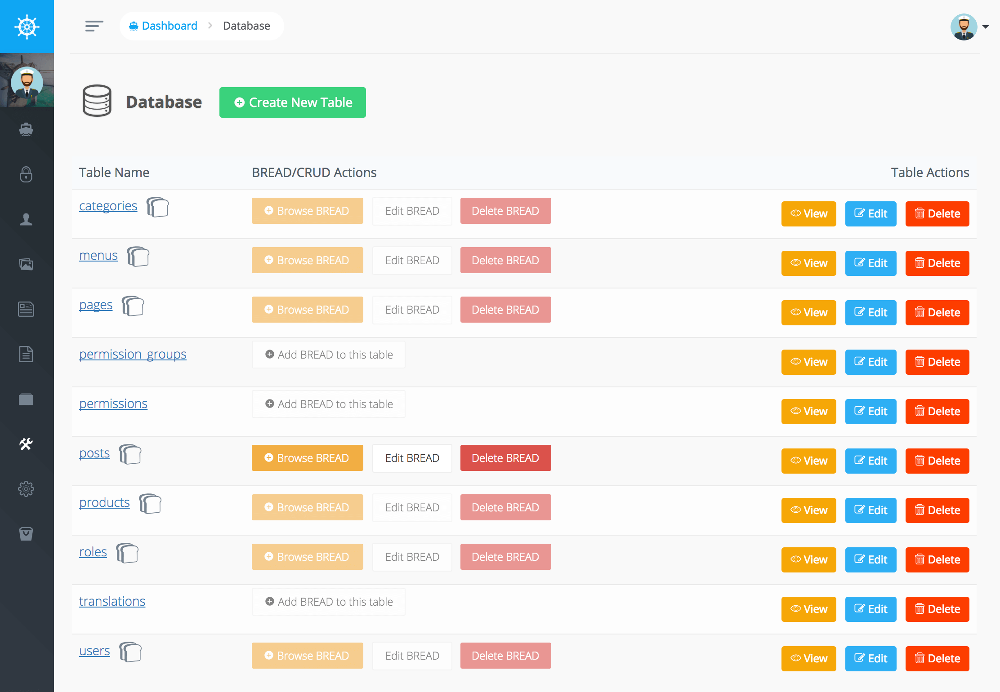

# 数据库管理器

Voyager有一些很棒的数据库工具，允许您添加/编辑/删除或查看当前的数据库表。旅行者的另一个很酷的部分是，你可以添加BREAD或（浏览，阅读，编辑，添加和删除）功能到你的任何表。

在管理面板中，您可以访问“工具”-&gt;“数据库”，并且可以查看数据库中的所有当前表。也可以单击“创建新表”在数据库中创建新表。

所有新创建的表都将使用在“默认数据库连接”中定义的字符集

如果单击表名，则可以查看当前表结构。此外，还可以单击“查看”、“编辑”或“删除”按钮来对该表执行该操作。

您还可以选择为任何数据库表添加BREAD（Browse, Read, Edit, Add, & Delete）。一旦一个表已经有BREAD，您可以选择编辑当前BREAD或删除该表的BREAD。

了解更多[BREAD生成器](../bread/introduction)。

