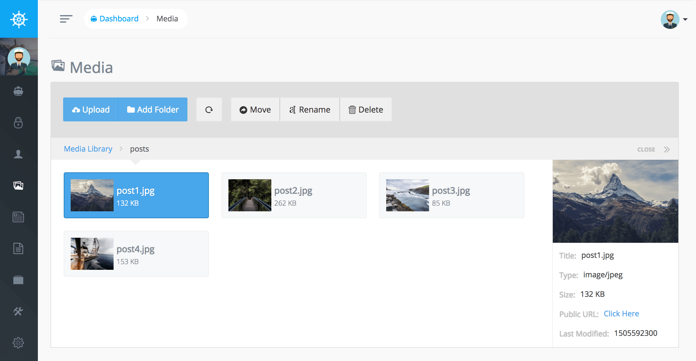

# 媒体管理器

Voyager有一个完善的媒体管理器，允许你上传文件，重新命名文件，删除文件。您还可以添加新文件夹和移动文件/文件夹。基本上，你在任何类型的媒体管理器中做的任何事情，Voyager媒体管理器都可以实现

您还可以将文件拖放到“上传”按钮以上传多个文件。
你可以通过媒体管理器设置缩略图，并通过配置文件为上传的图片添加水印。

查看 [媒体选择器文档](../bread/formfields/media-picker#watermark) 可以获得更多详细的配置  

::: warning 注意上传文件的大小
如果你在上传大文件的时候，遇到错误，这可能是需要更改php.ini中的`max_file_upload` 和 `file_upload_size`配置
::: 