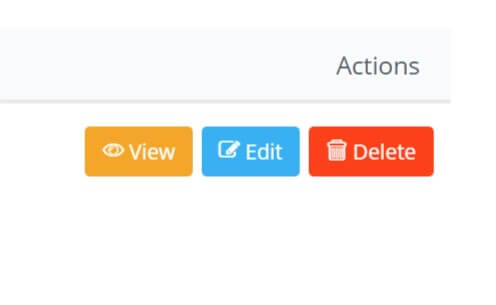
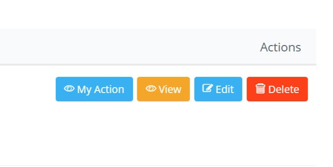

# 操作按钮

## 操作按钮

当浏览BREAD的时候每行旁边都将显示操作按钮



你可以很容易地添加自己的按钮。首先，我们将在`app/Actions/MyAction.php`中创建一个Action类，它扩展了Voyagers 的AbstractAction类

```php
<?php

namespace App\Actions;

use TCG\Voyager\Actions\AbstractAction;

class MyAction extends AbstractAction
{
    public function getTitle()
    {
        return 'My Action';
    }

    public function getIcon()
    {
        return 'voyager-eye';
    }

    public function getPolicy()
    {
        return 'read';
    }

    public function getAttributes()
    {
        return [
            'class' => 'btn btn-sm btn-primary pull-right',
        ];
    }

    public function getDefaultRoute()
    {
        return route('my.route');
    }
}
```

接下来我们需要告诉Voyager我们想使用这个动作。为此，打开`app/Providers/AppServiceProvider.php`并找到`boot()`方法，做如下修改

```php
<?php

namespace App\Providers;

use Illuminate\Support\ServiceProvider;
use Illuminate\Events\Dispatcher;
use TCG\Voyager\Facades\Voyager;

class AppServiceProvider extends ServiceProvider
{
    public function boot()
    {
        Voyager::addAction(\App\Actions\MyAction::class);
    }
}
```

在那之后，你在浏览BREAD时会看到你的新按钮



### 显示/隐藏操作按钮

如果只想在特定数据类型中显示操作按钮，则可以在你的Action类中实现函数`shouldActionDisplayOnDataType()`：

```php
<?php

public function shouldActionDisplayOnDataType()
{
    return $this->dataType->slug == 'posts';
}
```

## 全局操作按钮

全局操作按钮可以作用于一个模型的多个实例上。
如果想把你的操作按钮变成一个全局的，你可以添加如下方法:

```php
<?php

public function massAction($ids, $comingFrom)
{
    // Do something with the IDs
    return redirect($comingFrom);
}
```

