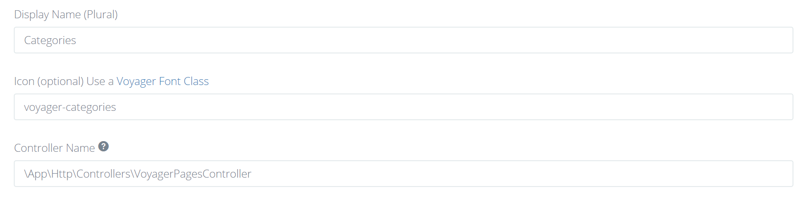

# 重写文件

## 重写BREAD视图文件

您可以通过在`resources/views/vendor/voyager/`目录中创建一个新文件夹`slug-name`来覆盖**单个**BREAD的任意BREAD视图，其中`slug-name`是为该表分配的`slug`。有4个文件可以覆盖：

- browse.blade.php
- edit-add.blade.php
- read.blade.php
- order.blade.php

或者，您可以通过在`resources/views/vendor/voyager/bread`下创建上述任何文件来覆盖所有BREAD的视图`

## 使用自定义布局
### 覆盖提交按钮:

通过扩展`submit-buttons`布局，您可以覆盖“提交”默认布局，而无需覆盖整个`edit-add.blade.php`：
```html
@extends('voyager::bread.edit-add')
@section('submit-buttons')
    @parent
    <button type="submit" class="btn btn-primary save">Save And Publish</button>
@endsection
```

## 使用自定义控制器

您可以通过创建继承Voyagers controller的控制器来覆盖单个BREAD的控制器，例如：

```php
<?php

namespace App\Http\Controllers;

class VoyagerCategoriesController extends \TCG\Voyager\Http\Controllers\VoyagerBaseController
{
    //...
}
```

之后，转到BREAD设置页并用带命名空间的类名填写控制器名称



现在你可以重写 [VoyagerBaseController](https://github.com/the-control-group/voyager/blob/1.3/src/Http/Controllers/VoyagerBaseController.php)类中的所有方法

## 重写 Voyagers 控制器

如果要覆盖任何Voyagers核心控制器，首先必须更改配置文件`config/voyager.php`

```php
/*
|--------------------------------------------------------------------------
| Controllers config
|--------------------------------------------------------------------------
|
| Here you can specify voyager controller settings
|
*/

'controllers' => [
    'namespace' => 'App\\Http\\Controllers\\Voyager',
],
```

然后运行 `php artisan voyager:controllers`命令, Voyager 现在将使用将在`App/Http/controllers/Voyager`中创建的子控制器


## 重写 Voyager模型

你也可以根据自己的需要来重写 Voyager模型

为此，你需要将以下内容添加到AppServiceProviders的 register方法中：

```php
Voyager::useModel($name, $object);
```

其中name是模型的类名，object是自定义模型的带命名空间的完整名称。例如：

```php
<?php

namespace App\Providers;

use Illuminate\Support\ServiceProvider;
use Illuminate\Events\Dispatcher;
use TCG\Voyager\Facades\Voyager;

class AppServiceProvider extends ServiceProvider
{
    public function register()
    {
        Voyager::useModel('DataRow', \App\DataRow::class);
    }
    // ...
}
```

下一步是创建模型并使其扩展原始模型。比如说`DataRow`：

```php
<?php

namespace App;

class DataRow extends \TCG\Voyager\Models\DataRow
{
    // ...
}
```

