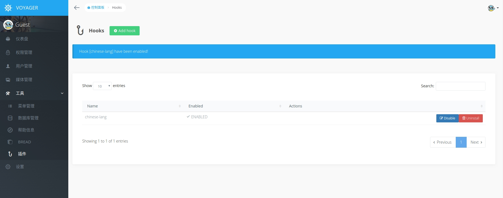

# 安装

Voyager安装非常简单，当你创建一个新的Laravel应用后，你可以按下面方式引入Voyager包

```bash
composer require tcg/voyager
```

接下来，请务必创建一个新的数据库，并在你的 .env文件中设置好连接信息，你也应该修改`APP_URL`成你的真是网址

```text
APP_URL=http://localhost
DB_HOST=localhost
DB_DATABASE=homestead
DB_USERNAME=homestead
DB_PASSWORD=secret
```

最后，我们可以安装Voyager。您可以选择使用虚拟数据或不使用虚拟数据安装Voyager。虚拟数据将包括1个管理帐户（如果没有用户已经存在）、1个演示页面、4个演示帖子、2个类别和7个设置。

不使用虚拟数据的安装方式

```bash
php artisan voyager:install
```

使用虚拟数据的安装方式

```bash
php artisan voyager:install --with-dummy
```

::: warning Specified key was too long error
如果你看到这样的错误提示，说明你使用的mysql版本已经过时了，可使用以下解决方案 [https://laravel-news.com/laravel-5-4-key-too-long-error](https://laravel-news.com/laravel-5-4-key-too-long-error)
:::

我们可以继续往下走了!

使用 `php artisan serve` 命令，可以开启一个本地开放环境，然后在浏览器中打开 [http://localhost:8000/admin](http://localhost:8000/admin) 

如果使用虚拟数据安装，则会为您创建一个具有以下登录凭据的用户：

> **email:** `admin@admin.com`  
> **password:** `password`

::: warning 温馨提示
如果在数据库中一个用户没有，这个虚拟用户就会被创建
:::

如果您没有使用虚拟用户，您可能希望将管理员权限分配给现有用户。可以通过运行以下命令轻松完成此操作：

```bash
php artisan voyager:admin your@email.com
```

如果要创建新的管理员用户，可以传递“--create”标志，如下所示：

```bash
php artisan voyager:admin your@email.com --create
```

系统会提示您输入用户名和密码。

## 安装中文语言包

::: warning 提示
由于voyager官方的插件仓库有bug，不能更新插件的版本，所以我们需要把插件下载源改成`http://satisfy.xiaoqiezi.top`
:::

### 更改voyager插件源

打开`composer.json`文件
找到
```json
{
    "repositories": {
        "hooks": {
            "type": "composer",
            "url": "https://larapack.io"
        }
    }
}
```
把它改成如下：
```json
{
    "repositories": {
        "hooks": {
            "type": "composer",
            "url": "http://satisfy.xiaoqiezi.top"
        }
    }
}
```

因为我们的`satisfy.xiaoqiezi.top`域名还没有申请证书，接下来需要找到`compsoer.json`的`config`部分，添加`secure-http`参数，并把值设置`false`，暂不校验https证书，如下所示：

```json
{
    "config": {
        ...
        "secure-http": false
    },
    ...
}
```

打开`App\Providers\AppServiceProvider.php` 文件，在`register`方法中添加如下代码：
```php
use Larapack\Hooks\Hooks;

$this->app->resolving(Hooks::class, function ($api, $app) {
    $this->app[Hooks::class]::setRemote('http://satisfy.xiaoqiezi.top');
    $this->app[Hooks::class]->readJsonFile();
});
```

### 安装chinese-lang插件

在项目根目录中打开命令行，运行如下代码
```bash
php artisan hook:install chinese-lang
```

少等片刻，插件安装成功后，来到voyager管理面板，找到hooks菜单(路经：Tool->Hooks)，我们可以发现刚刚安装的插件，点击`Enable`按钮，开启插件，我们可以看到一个崭新的中文界面



::: warning 注意
为了对原有系统侵入性最小，我们保留了原先的英文的菜单组，另外创建了一个以`admin-zh-CN`命名的新菜单组，可以在后台的`菜单管理`中找到，希望大家在使用本插件的时候，不要修改菜单组的名字，否则会报异常。你可以在该菜单组中添加/修改或删除菜单
:::
至此，中文语言安装完成~

## 高级

本节是针对正在安装已经存在的Laravel安装程序或想要执行手动安装Voyager的用户。如果不是这样，请跳过本节。

第一件事你应该做的是发布Voyager附带的资源。可以通过运行以下命令来执行此操作：

```bash
php artisan vendor:publish --provider="TCG\Voyager\VoyagerServiceProvider"
php artisan vendor:publish --provider="Intervention\Image\ImageServiceProviderLaravel5"
```

接下来，运行 `php artisan migrate` 执行数据库迁移操作

::: warning 注意
如果你想修改数据库迁移文件，比如说为用户表换一个名字，请不要执行上面的迁移，而应该复制Voyagers的迁移文件到`database/migrations`目录中，
然后打开Voyager的配置文件，将`database.autoload_migrations` 设置为关闭状态，然后执行即可执行自定义的迁移操作
:::

现在，打开你的用户模型\(通常是 `app/User.php`\)，然后让这个类继承`\TCG\Voyager\Models\User`，用来代替`Authenticatable`

```php
<?php

class User extends \TCG\Voyager\Models\User
{
    // ...
}
```

下一步，将Voyagers 的所有路由配置放到你的`routes/web.php`文件中：

```php
<?php

Route::group(['prefix' => 'admin'], function () {
    Voyager::routes();
});
```

现在运行命令
`php artisan db:seed --class=VoyagerDatabaseSeeder`  
用来在你的数据库中填充一些必要的数据
`php artisan hook:setup`  
用来安装hooks系统,  和
`php artisan storage:link`  
用来将storage文件系统在public目录生存软连接

之后，运行 `composer dump-autoload` 即可完成安装

