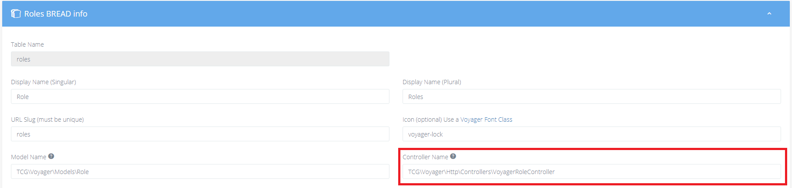

# 升级指南

## 从 1.3 升级到 1.4 

::: warning tip
升级前，请先查看我们的[安装前提](prerequisites.md)
:::

### 更新你的 Composer.json

要更新到 composer.json 文件内的最新版本，请确保将 composer.json 内的 require 声明内的 Voyager 版本更新为:

`tcg/voyager": "1.4.*`

然后运行  `composer update`

### 升级你的 BREAD 角色

角色BREAD现在使用它自己的控制器。

请更新以使用它 `TCG\Voyager\Http\Controllers\VoyagerRoleController`

### TinyMCE 初始化

初始化操作已经从 app.js 中移除，取而代之的是使用 rich_text_box 模板，如果在标准模板之外使用TinyMCE，请查看文档
 [TinyMCE](/bread/formfields/tinymce.md)

### 故障排除

如果您遇到任何问题，请务必在我们的slack频道询问我们，我们将尽力提供帮助。谢谢。